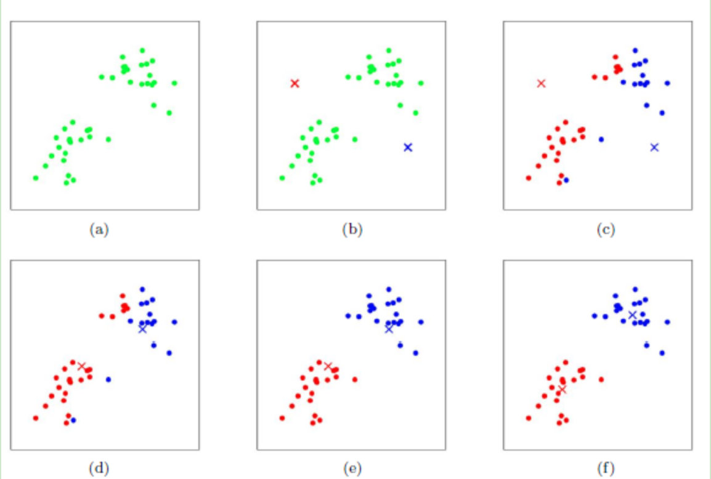

# **Image Segmentation**

**Background**: Image segmentation has a wide range of applications. It can assist in complex tasks in medicine, industry. Most of the open source use complicated algorithm to make it. I implement the classical machine learning algorithm to achieve it. The project has convient interface  

### Usage: 

```bash
git clone https://github.com/1zeryu/Image-Segmentation.git
```

The main code is in SegByKmeans directory. 

Before usage, you must make a example directory through

```bash
cd SegByKmeans
mkdir example
```

The main parameters are as follows:

```bash
usage: Seg.py [-h] [-k K] [--MaxIter MAXITER] [--seed SEED]
              [--resultPath RESULTPATH]
              ImageName

hyper parameters for kmeans

positional arguments:
  ImageName             select the image file name, must in the example
                        directory

optional arguments:
  -h, --help            show this help message and exit
  -k K                  number of center
  --MaxIter MAXITER     max iterations of kmeans algorithm
  --seed SEED           seed for random center
  --resultPath RESULTPATH
                        Specify the path to the generated file, the default is
                        the current folder
```

## K-means Algorithm

**Algorithm:** 

1.  Initialize cluster cores
2. Calculate the distance of the sample from the center of mass
3. Attributing samples to their nearest center and calculating the mean of samples of the same class, update the mean to cluster cores
4. Iterate repeatedly until the center of mass is stable or reach the max iterations

  

**Detail**:

Calculate distance: $dist = |\alpha - \beta|_2$

```python
def minDisctance(dataset, centroidList):  # 传入数据集和选取的质心列表
  clusterDict = dict()  
  k = len(centroidList)  
  for item in dataset:  
    vec1 = item  # Vectors in the data
    flag = -1  # Logo position
    minDis = float("inf")   # Initialize to maximum value
    for i in range(k):
      vec2 = centroidList[i]   
      distcance = calcudistance(vec1, vec2)   # Calculate Euclidean distance
      if distance < minDis:   
        minDis = distance  
        flag = i  
    if flag not in clusterDict.keys():
      clusterDict.setdefault(flag,[])
    clusterDict[flag].append(item)  
  return clusterDict  # different category

def calcudistance(vec1,vec2):  # input two vector
  return np.sqrt(np.sum(np.square(vec1 - vec2)))
```

## Demo

*Origin:*


*Target:*

